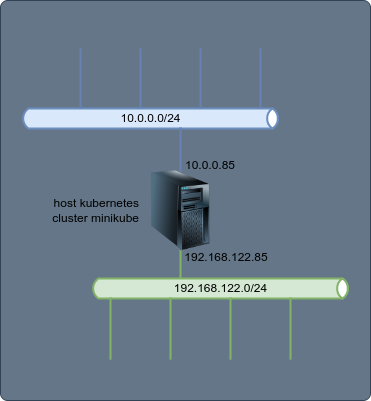
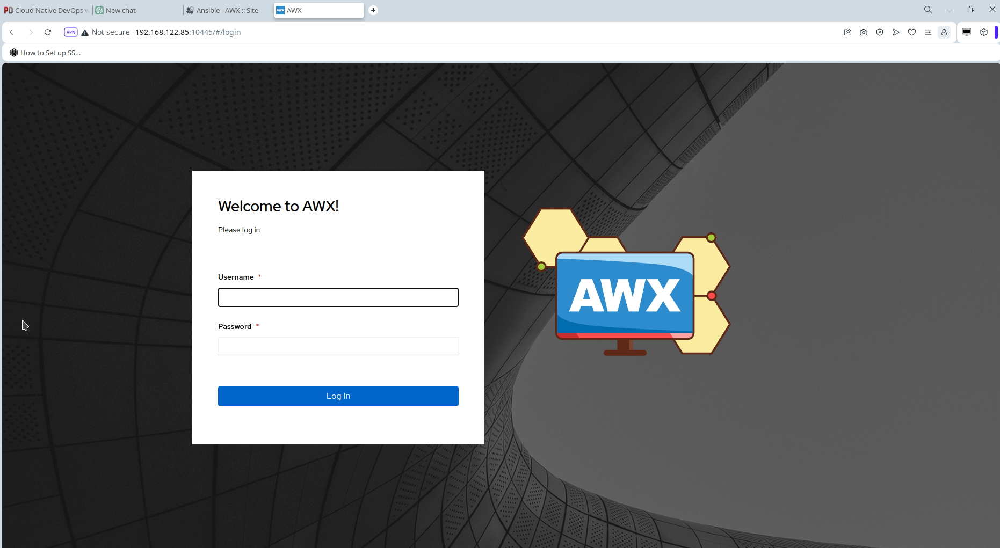

+++
tags = ["kubernetes","projects"]
title = "Ansible - AWX"
weight = 20
description = "Este proyecto es el despliegue de Ansible AWX, edición comunitaria de Red Hat Ansible Tower."
+++

Este proyecto es el despliegue de ___Ansible AWX___, edición comunitaria de ___Red Hat Ansible Tower___.

En la siguiente representación se muestra un diagrama del despliegue. El cual es realizado sobre un _host motor_ de _kubernetes_ con _minikube_ con _libvirt_ como runtime (driver _kvm_).



## Tecnologías utilizadas

- Contenedores: kubernetes / k3s or minikube
- Dist. Linux: AlmaLinux 9

## Sesión de instalación/configuración

La sesión siguiente fue realizada tanto sobre un cluster de minikube como en uno con k3s. Aquí se comparte el despligue realizado con k3s.
 
```bash
# Ansible AWX in kubernetes k3s 
git clone https://github.com/ansible/awx-operator.git 
cd awx-operator/
git checkout 2.2.1
git branch
export NAMESPACE=ansible-awx
make deploy
kubectl get pods -n $NAMESPACE
cp awx-demo.yml ansible-awx.yml
# Modifico el nombre del namespace a crear
sed -i 's/name: awx-demo/name: ansible-awx/g' ansible-awx.yml
sudo /usr/local/bin/kubectl config set-context --current --namespace=$NAMESPACE
kubectl apply -f ansible-awx.yml
# Reviso el estado del despliegue, para luego continuar
kubectl logs -f deployments/awx-operator-controller-manager -c awx-manager 
kubectl get pods -l "app.kubernetes.io/managed-by=awx-operator" 
kubectl get service -l "app.kubernetes.io/managed-by=awx-operator" 
# Genero una primera contraseña para el usuario admin pueda ingresar a la interface web
kubectl get secret ansible-awx-admin-password -o jsonpath="{.data.password}" | base64 --decode; echo
# Forward al servicio para acceder externamente
kubectl port-forward service/ansible-awx-service --address 0.0.0.0 10445:80 &
```

Ansible AWX debería estar disponible en el URL `http://<IP_SERVIDOR_KUBERNETES>:10445`. En este caso ahora implementado el ingreso a la interface Web se muestra en la siguiente captura.



## Repositorio

...
