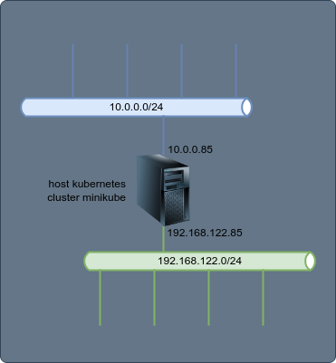
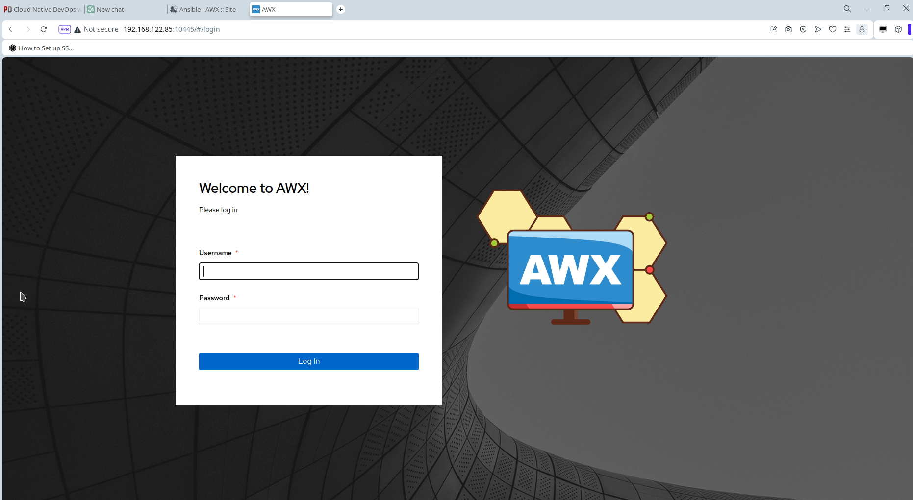

+++
tags = ["kubernetes","projects"]
title = "Ansible - AWX"
weight = 1
+++

Este proyecto es el despliegue de ___Ansible AWX___, que es la edición comunitaria de ___Red Hat Ansible Tower___.

En la siguiente representación se muestra un diagrama del despliegue. El cual es realizado sobre un _host motor_ de _kubernetes_ con _minikube_ con _libvirt_ como runtime (driver _kvm_).



## Tecnologías utilizadas

- Contenedores: kubernetes / minikube
- Dist. Linux: AlmaLinux 9

## Sesión de instalación/configuración

```bash
kubectl get pods -A
git clone https://github.com/ansible/awx-operator.git
cd awx-operator/
git branch
# Revisar en https://github.com/ansible/awx-operator.git la última versión
git checkout 2.2.1
git branch
export NAMESPACE=ansible-awx
## source /etc/profile.d/snap.sh
make deploy
kubectl get pods -n $NAMESPACE
kubectl get pods -A
kubectl get pods -n $NAMESPACE
cp awx-demo.yml ansible-awx.yml
vi ansible-awx.yml
kubectl config set-context --current --namespace=$NAMESPACE
kubectl apply -f ansible-awx.yml
## Con el siguiente comando se puede ver el estado de la instalación
kubectl logs -f deployments/awx-operator-controller-manager -c awx-manager
kubectl get pods -n $NAMESPACE
kubectl get pods -l "app.kubernetes.io/managed-by=awx-operator"
kubectl get service -l "app.kubernetes.io/managed-by=awx-operator"
minikube service ansible-awx-service --url -n ansible-awx
# Con el siguiente comando tengo el password para el usuario "admin"
kubectl get secret ansible-awx-admin-password -o jsonpath="{.data.password}" | base64 --decode; echo
kubectl port-forward service/ansible-awx-service --address 0.0.0.0 10445:80
```

Ansible AWX debería estar disponible en el URL `http://<IP_SERVIDOR_MINIKUBE>:10445`. En este caso ahora implementado el ingreso a la interface Web se muestra en la siguiente captura.



## Repositorio

...
